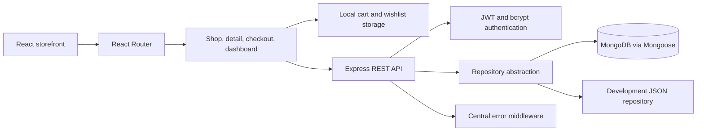
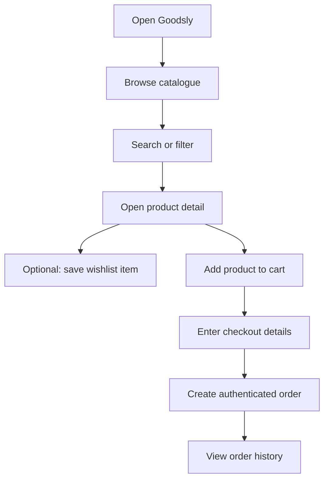
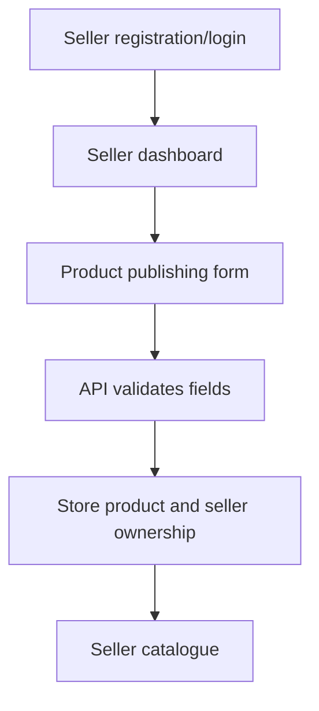
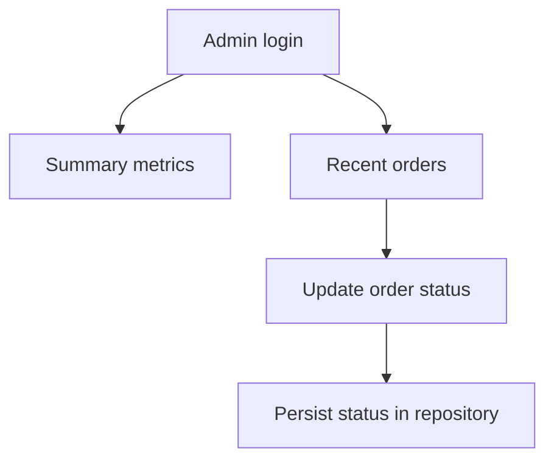
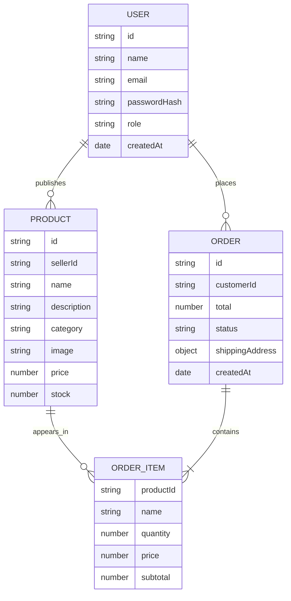
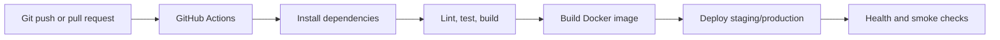

# Goodsly — Multi-Vendor E-commerce Platform Case Study

## Executive summary

Goodsly is a React and Express commerce platform for performance clothing and sports equipment. It combines a visual storefront with JWT-authenticated customer, seller, and admin workspaces. The current release provides catalogue discovery, product colorway presentation, cart and checkout flows, seller publishing, administrative order operations, and MongoDB-backed persistence.

This document separates shipped functionality from planned platform extensions. That distinction keeps the case study technically accurate while showing how Goodsly can grow into the complete multi-vendor architecture.

## Goals

1. Make performance products easy to discover through categories, search, tags, and colorways.
2. Give sellers a simple path to publish products.
3. Give administrators visibility into orders and revenue.
4. Provide a secure foundation for payments, messaging, media, and notifications.
5. Keep the system modular enough to scale from a single deployment to multiple API and WebSocket instances.

## Product experience

### Implemented user roles

| Role | Current capabilities |
| --- | --- |
| Buyer/customer | Register, log in, browse, search, save wishlist items, manage cart, submit checkout, view local order history |
| Seller | Register, publish products, view seller catalogue, access authenticated APIs |
| Admin | View order summary, inspect recent orders, update order status |

### Implemented catalogue behavior

- Product cards with category, price, badge, description, and named color swatches
- Product detail pages with image, description, colorways, sizes, cart action, and wishlist action
- Search across name, category, description, color, and product tags
- Category tabs for Running, Training, Basketball, Football, Studio, Outdoor, and All
- Basketball catalogue content including an actual jersey image

## System architecture

The repository abstraction allows local development to continue when MongoDB is unavailable. Production deployments should use MongoDB as the authoritative store and should disable or tightly constrain fallback persistence.

## Application flows

### Buyer flow

### Seller flow

### Admin flow

## Data model

## API architecture

The API is organized by business capability:

- `/api/v1/auth` — registration, login, and current-user lookup
- `/api/v1/products` — public listing plus seller/admin publishing and management
- `/api/v1/orders` — authenticated order creation, listing, and status updates
- `/api/v1/admin` — admin-only summary and order operations
- `/api/v1/health` — deployment health signal

Authentication is enforced by middleware that verifies a JWT and attaches the public user to the request. Role authorization is applied to seller and admin routes.

## Tech stack

### Current implementation

| Area | Technology |
| --- | --- |
| Frontend | React 19, React Router, React Icons, Create React App |
| Backend | Node.js, Express 5 |
| Persistence | MongoDB, Mongoose, development JSON repository |
| Authentication | JWT, bcrypt |
| Configuration | dotenv |
| Frontend state | React state and local storage for cart/wishlist |

### Planned platform extensions

| Capability | Proposed technology |
| --- | --- |
| Real-time chat | Socket.IO, MongoDB message history, Redis adapter |
| Payments | Stripe and PayPal provider adapters, signed webhooks |
| Media | Cloudinary or Amazon S3 |
| Push notifications | Web Push and service workers |
| Analytics | MongoDB aggregation pipelines and Recharts |
| Delivery | Docker, GitHub Actions, managed MongoDB/Redis |
| Monitoring | Sentry, structured logs, uptime checks |

## Advanced architecture roadmap

### Real-time messaging

Add `Conversation` and `Message` models, authenticated Socket.IO connections, conversation rooms, message persistence, read receipts, typing indicators, and REST history endpoints. The server must derive the sender from the verified socket identity rather than trusting a client-supplied user ID.

### Payments

Introduce a provider interface with Stripe and PayPal adapters. The backend should calculate totals from database prices, create payment intents, verify signed webhooks, and only mark orders paid after provider confirmation. Orders should gain `paymentProvider`, `paymentIntentId`, `paymentStatus`, `currency`, and `paidAt`.

### Notifications

Add persisted in-app notifications for new orders, status changes, messages, and inventory events. Add browser push subscriptions through a service worker and VAPID keys stored only in environment configuration.

### Seller analytics

Add seller-scoped aggregation endpoints for revenue, order count, average order value, product performance, inventory, and time-series reporting. Render those metrics in a dedicated seller analytics workspace.

### Cloud media

Replace URL-only product images with validated multipart uploads. The backend should enforce seller authorization, MIME type, file size, dimensions, and image count before storing cloud URLs and provider public IDs.

## Security and reliability plan

The current application has JWT role checks, bcrypt password hashing, CORS allowlisting, bounded request parsing, and centralized errors. Before production, add:

- Strong required JWT secrets and secret management
- Request schema validation and sanitization
- Helmet security headers and rate limiting
- Refresh-token rotation, email verification, and password reset
- Signed payment webhooks
- Upload scanning and file restrictions
- Structured logs, audit trails, Sentry, and dependency monitoring
- Automated tests for authorization, stock, order totals, and webhook idempotency

## CI/CD and deployment plan

The recommended deployment separates the React static build from the API service. MongoDB Atlas, object storage, Redis, payment providers, and monitoring should be managed services with environment-specific credentials.

## Challenges and solutions

### Keeping product discovery expressive

Products expose category, color, description, and tags so search can match the way customers naturally describe sports gear.

### Supporting development without hiding production failures

The repository abstraction provides a development fallback, while the API health response exposes the active storage mode. Production configuration should require a reachable MongoDB service rather than silently relying on local JSON persistence.

### Protecting role-specific operations

Authentication and role authorization are separate middleware concerns. This keeps public product reads simple while protecting seller publishing and admin operations.

## Best-practice checklist

- [x] Reusable frontend product and colorway components
- [x] API routes separated by business capability
- [x] Centralized error response format
- [x] Role-aware access control
- [x] MongoDB connection configuration
- [ ] Automated test suite for core API behavior
- [ ] Payment provider abstraction and webhook tests
- [ ] Real-time chat authorization and persistence
- [ ] Cloud upload validation
- [ ] Production CI/CD and monitoring

## Conclusion

Goodsly currently delivers the foundation of a multi-vendor commerce product: a refined storefront, role-aware API, product publishing, order operations, and MongoDB support. The architecture diagrams and roadmap define the path to the full case-study platform without presenting unbuilt capabilities as shipped functionality.
